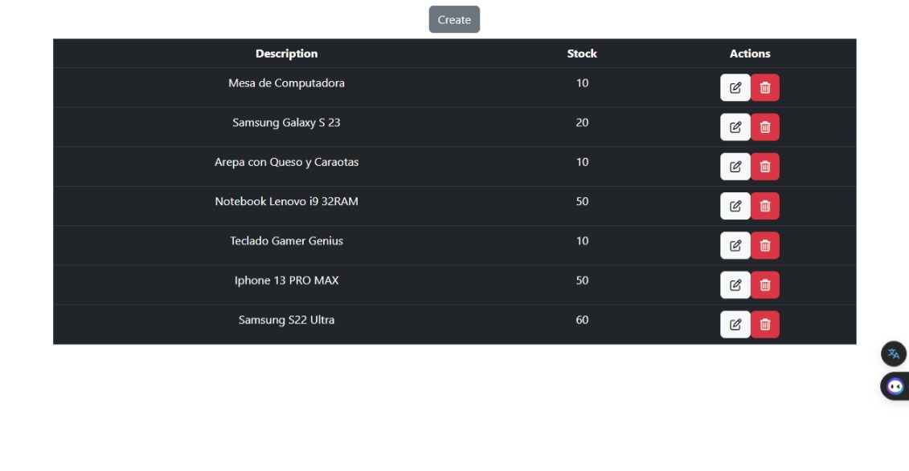
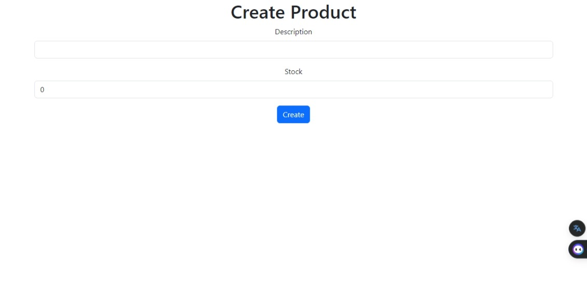
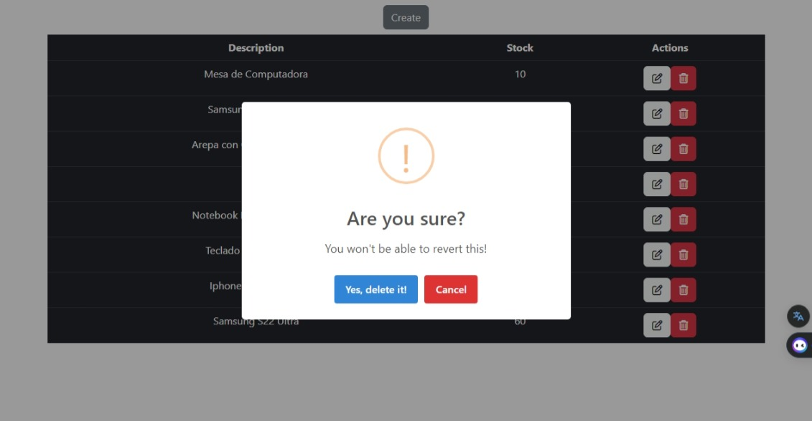
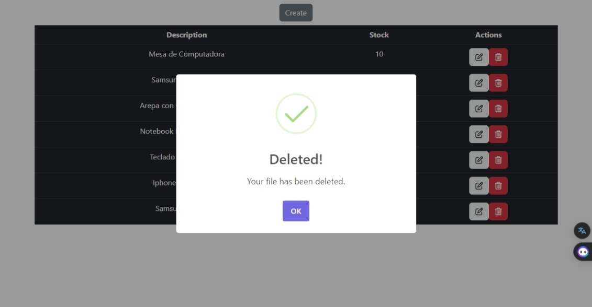
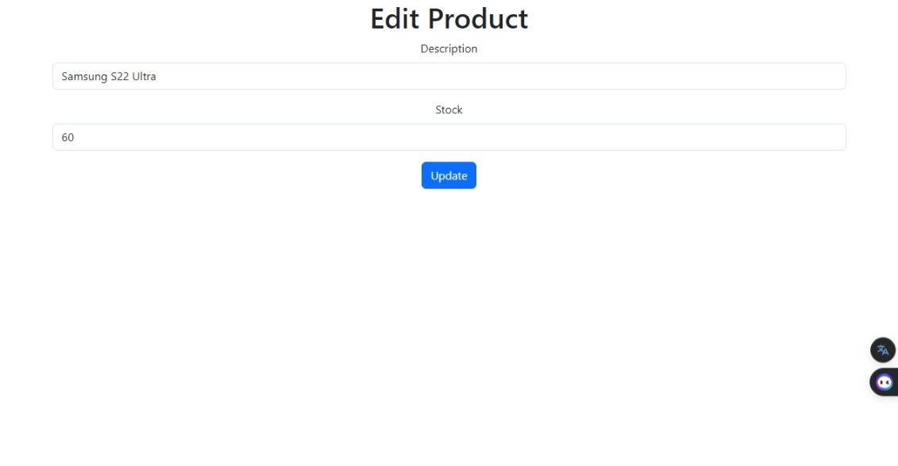
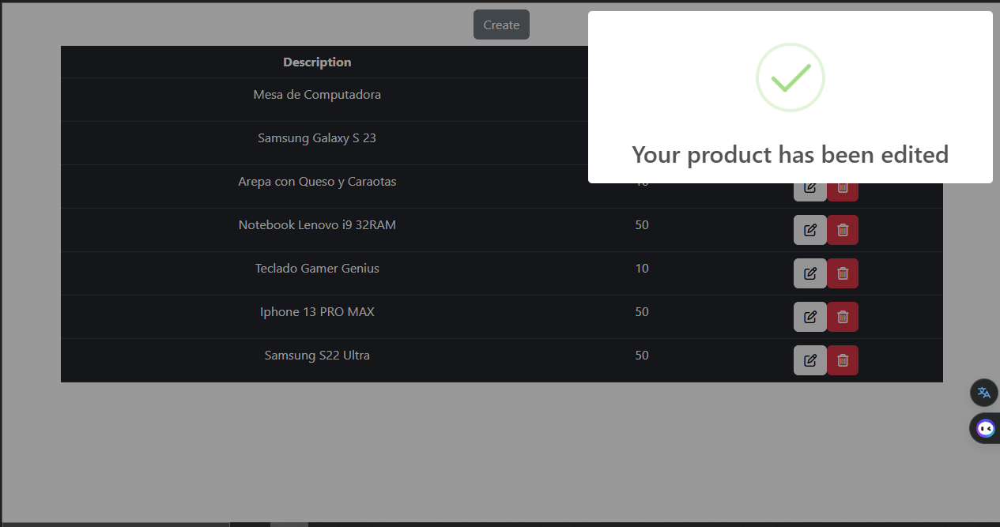

# Aplicación de Registro de Productos (Firestore-React-CRUD)

<!--  -->

  

## Descripción

Esta [Aplicación](https://firebase-react-crud.vercel.app/) es una forma basica de realizar alamcenamiento de datos con descripcion y stock, a demas de funcionalidades como editar el producto y eliminarlo.

La idea principal de este proyecto es practicar el uso de el [Framework React](https://legacy.reactjs.org/docs/getting-started.html) cuando se utiliza: "npx create-react-app nombre-del-proyecto", y adaptar la plataforma de Firebase con sus funcionalidades de firestore database.

Además del framework de React, también se utilizaron otras librerías como: [Bootstrap](https://getbootstrap.com/), [Font Awesome](https://fontawesome.com/) y [Sweet Alert](https://sweetalert2.github.io/) para definir estilos.

[FIREBASE](https://firebase.google.com) es básicamente un servicio en la nube de Google, lo que significa que te permite tener una base de datos en la nube de manera sencilla. Te permite cargar archivos, autenticar usuarios e incluso procesar archivos de imágenes y más, como el aprendizaje automático, por ejemplo. En este caso, estaremos utilizando un producto llamado FIREBASE DATABASE.

## Características de la Aplicación

- Característica 1: Registrar Productos.
- Característica 2: Editar Productos.
- Característica 3: Eliminar Productos.
- Característica 4: Guardar registros en la plataforma de Firebase con el servicio de [Firestore Database](https://firebase.google.com/products/firestore?hl=es-419).
- Caracteristica 5: Uso de estilos con framework [Bootstrap](https://getbootstrap.com/).
- Caracteristica 6: Uso de estilos con framework [Font Awesome](https://fontawesome.com/).
- Caracteristica 6: Uso de estilos con framework [Sweet Alert](https://sweetalert2.github.io/).

## Instalación

1. Abre la terminal
2. [Clona el repositorio](https://github.com/Alemar16/Firebase-React-CRUD.git).
3. Instala las dependencias con `npm install`
4. Inicia el proyecto con `npm start`

## Uso

1. Solo debes ingresar a este [enlace de la Aplicación](https://firebase-react-crud.vercel.app/).

## versiones

1. NodeJS: `20.5.1`
2. React: `18.2.0`

## Imagenes de la aplicación

  
  

  
  

  
  

